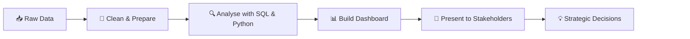

<h1 align="center">Hi there, I'm Lakshasini S 👋</h1>

<h3 align="center">🎓 Engineering Student (Artificial Intelligence & Data Science) | Aspiring Data Analyst & Business Analyst | Cybersecurity Enthusiast</h3>

  
  
  

<i>Turning raw data into clear decisions.</i>

---

## 📖 About Me

- 🎓 **What I Study:** Pursuing a Bachelor of Engineering in **Artificial Intelligence and Data Science** at **St. Joseph's College of Engineering, Chennai**.
- 🚀 **Core Target:** Becoming a **Data Analyst** who combines **business analysis** with **coding**, so that insights are both technically sound and commercially useful.
- 🔐 **Also Passionate About:** **Ethical hacking and cybersecurity**, and how securing data goes hand in hand with analysing it.
- 📚 **Currently Learning:** **SQL**, **Python**, and the **French** language 🇫🇷.
- 💬 **Ask me about:** Coding and tech-related skills.
- ⚡ **Fun fact:** I enjoy turning messy, confusing data into a clean story, and I'm learning French so that one day I can present insights in more than one language.

---

## 🛠 Tech Stack & Tooling

| Domain | Technologies & Tools |
|---|---|
| **Languages** | SQL, Python |
| **Operating Systems** | Windows |
| **Tools & Environments** | Git, GitHub, VS Code |
| **Spoken / Learning Languages** | English, French (learning) |

  
  
  
  
  
  

---

## 🔄 How I Approach Data

---

## 📌 Featured Repositories

### 🗃️ [sql-practice-workbook](https://github.com/lakshasini/sql-practice-workbook)
A learning workspace for SQL queries, covering filtering, joins, aggregation, and data cleaning exercises.
`SQL` • `Data Analysis` • `Practice`

### 🐍 [python-data-analysis](https://github.com/lakshasini/python-data-analysis)
Python scripts and notebooks for cleaning, exploring, and visualising datasets.
`Python` • `Data Cleaning` • `Visualisation`

### 📈 [business-insights-dashboard](https://github.com/lakshasini/business-insights-dashboard)
A project that turns raw business data into a clean, stakeholder-ready summary of key metrics and trends.
`Business Analysis` • `Dashboards` • `Reporting`

### 🔐 [cybersecurity-learning-log](https://github.com/lakshasini/cybersecurity-learning-log)
Notes and beginner-friendly exercises on ethical hacking and security fundamentals.
`Cybersecurity` • `Ethical Hacking` • `Notes`

---

## 🗺 Career Roadmap

- 🟩 **[done]** Completed Higher Secondary School.
- 🔵 **[in progress]** Earning my B.E. in Artificial Intelligence and Data Science while building strong SQL and Python skills.
- 🎯 **[next goal]** Pursue a Master's degree abroad to sharpen my coding and data analysis skills.
- 🚀 **[long-term]** Work as a Data Analyst integrated with Business Analysis: turning raw data into clean dashboards, presenting them to stakeholders, and driving the company towards genuine profit through strategic decisions.

---

## 🏆 Certifications & Achievements

- 🏅 **Degree Candidate:** B.E. Artificial Intelligence and Data Science, *St. Joseph's College of Engineering*
- 🤖 **Certificate Program:** *Skill India: Unlocking AI for Beginners*
- 🚀 **Foundational Track:** Currently targeting courses that offer **SQL** and **Python**.

---

## 🎯 Current Focus

| Area | Focus |
|---|---|
| 📊 **Data Analysis** | Writing SQL queries and using Python to explore and clean data |
| 💼 **Business Thinking** | Learning how data insights translate into business decisions |
| 🔐 **Cybersecurity** | Understanding ethical hacking and security fundamentals |
| 🌍 **Languages** | Practising French alongside technical skills |

---

## 📊 My GitHub Dashboard

*Just like a business dashboard, this tracks my progress over time: what I'm building, how consistently I'm coding, and what I'm learning. Every number here will grow as I do.*

### 🔹 Key Performance Indicators

<table>
  <tr>
    <td align="center"></td>
    <td align="center"></td>
    <td align="center"></td>
    <td align="center"></td>
  </tr>
</table>

### 🔹 Performance Overview

### 🔹 Contribution Trend

### 🔹 Technology Mix

### 🔹 Learning Progress Tracker

| Skill | Progress | Status |
|:---|:---|:---|
| 🐍 **Python** | `▰▰▰▱▱▱▱▱▱▱` 30% | Learning fundamentals |
| 🗃️ **SQL** | `▰▰▱▱▱▱▱▱▱▱` 20% | Learning queries |
| 🔐 **Cybersecurity** | `▰▱▱▱▱▱▱▱▱▱` 10% | Exploring basics |
| 🇫🇷 **French** | `▰▰▰▰▰▰▰▰▱▱` 80% | |

*Self-assessed and updated as I learn.*

## 💭 My Philosophy

> *Data on its own is just numbers. Its value comes from the decisions it helps people make.*

---

## 📬 Connect With Me

- 🤝 Open to collaborating on data analysis projects and discussing coding, tech, and cybersecurity.
- 🔗 Reach out via [Lakshasini S | LinkedIn](https://www.linkedin.com/in/lakshasini-s-3b4527433/)
- ✉️ Or send an email to [lakshasini.s16@gmail.com](mailto:lakshasini.s16@gmail.com)

<i>Thanks for visiting my profile! ✨</i>

